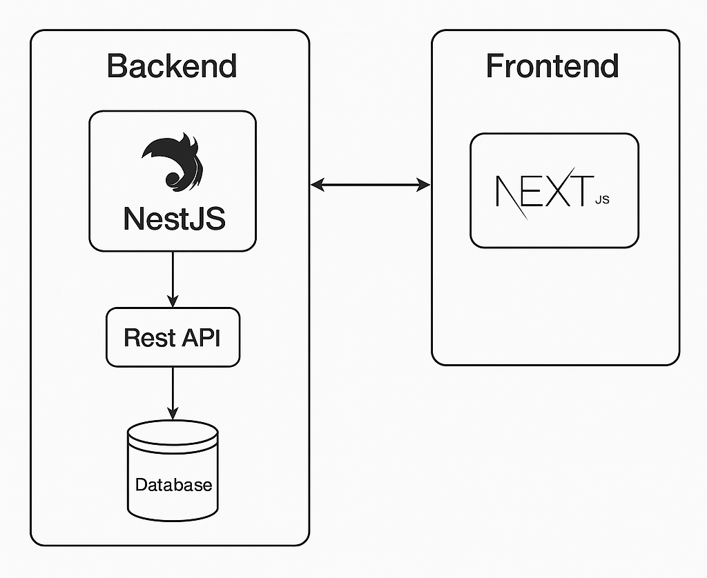
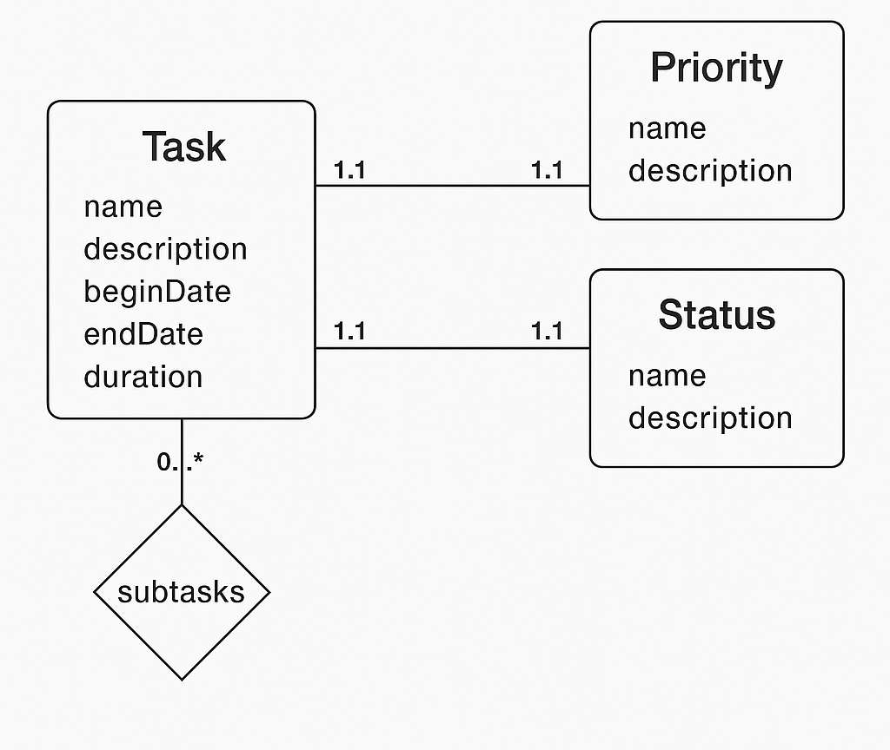

# Documentación del Proyecto: Gestor de Tareas

[🚀 Frontend en producción (Vercel)](https://prueba-full-stack.vercel.app/)

[🌐 Backend en producción (Render)](https://prueba-full-stack-1.onrender.com)

[📄 Ver documentación Swagger](https://prueba-full-stack-1.onrender.com/api)

## Historias de Usuario

### Historia 1: Crear tareas y subtareas

**Como** Despachador de torrefactora,  
**quiero** Crear mis tareas y subtareas diarias con su nombre, descripción y
duración de la tarea en minutos, actualizarlas y si es el caso borrarlas
**para** Llevar un registro de las tareas ejecutadas diariamente

---

### Historia 2: Ver tareas ordenadas según prioridad y duración

**Como** Despachador de torrefactora,  
**quiero** Asignarle un estado a cada tarea: Iniciada, En Proceso, Terminada,  
**para** Tener trazabilidad del avance de mis tareas diarias.

---

### Historia 3: Acceso vía API REST

**Como** Despachador de torrefactora
**quiero** Tener un tablero de control de mis tareas donde pueda ver su estado y
prioridad y el orden de atención sugerido por el sistema, basado en la
duración y en el algoritmo de planificación por prioridad “al más corto”
(SJF, Short Job First). \*

**para** Visualizar de manera rápida cual tarea se debe gestionar

---

## Tecnologías utilizadas

| Capa          | Tecnología              |
| ------------- | ----------------------- |
| Backend       | NestJS (Node.js)        |
| Base de datos | PostgreSQL + TypeORM    |
| Contenedores  | Docker + Docker Compose |
| API REST      | JSON RESTful            |
| swagger       | Documentacion           |

## Diagrama del diseño de la aplicación



---

## Diagrama base de datos



---

## Documentación de la API

Puedes ver la documentación Swagger aquí:

[👉 Ver Swagger UI](https://prueba-full-stack-1.onrender.com/api)

## Instalación local

1. Clona el repositorio:

   ```bash
   git clone https://github.com/dbravo13/Prueba-Full-Stack
   ```

### Backend

1. Entra a la carpeta del proyecto:

   ```bash
   cd torrefactora-api
   ```

2. Entra a la carpeta del proyecto:
   La aplicación corre en contenedores Docker. Se utilizan dos servicios:

- `api`: backend en NestJS
- `db`: base de datos PostgreSQL

Todo el sistema se levanta con un solo comando:

```bash
docker-compose up --build
```

Accede:
API: http://localhost:3000

Swagger: http://localhost:3000/api

> ⚠️ **Nota:** Si solo necesitas la base de datos, puedes levantarla con: `docker compose up -d db`.

### Configura las .env

Crea un archivo .env en torrefactora-api con el siguiente contenido.

```bash
# APP
PORT=3009

# DATABASE
DATABASE_HOST=localhost
DATABASE_PORT=5432
DATABASE_USER=name
DATABASE_PASSWORD=password
DATABASE_NAME=name
POSTGRES_SSL="false"
```

Accede:
API: http://localhost:3009

Swagger: http://localhost:3009/api

### Frontend

1. Entra a la carpeta del proyecto:

   ```bash
   cd torrefactora-client
   ```

2. Instalar dependencias

   ```bash
   npm install
   ```

3. Correr codigo

   ```bash
   npm run dev
   ```

4. Crea un archivo .env.local con la URL del backend:

   ```bash
   NEXT_PUBLIC_URL_BACKEND= "http://localhost:3009"
   ```
